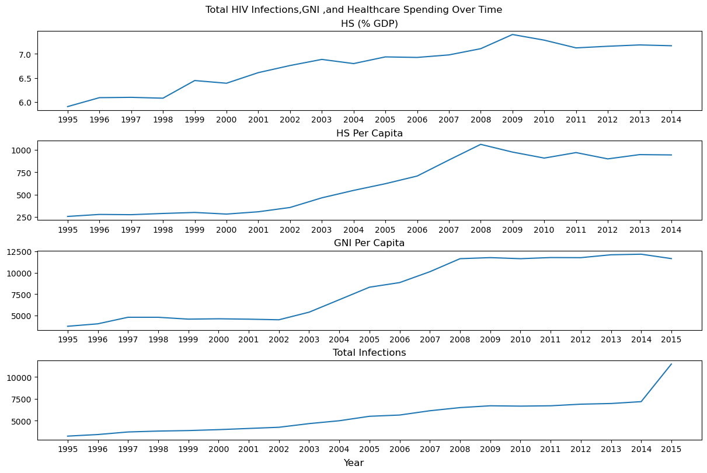

# Python EDA Case Study
By: Joel Encarnacion, Jasmine Hardin, Andrew Orlando, Blake Powell

## Table of Contents
1. [About Dataset](#about-dataset)
2. [Questions](#questions)
4. [Curation](#curation)
5. [Visualization](#visualization)
6. [Exploration](#exploration)
7. [Analysis](#analysis)
8. [Conclusion](#conclusion)
9. [Sources](#sources)

## *About Dataset*
health_nutrition.csv:

Data was acquired from the World Bank and includes 345 indicators, such as immunization rates, malnutrition prevalence, and vitamin A supplementation rates across 263 countries around the world from 1960 to 2015.

Source: https://www.kaggle.com/datasets/theworldbank/health-nutrition-and-population-statistics

global_economy_indicators.csv:

Data was a custom data set acquired from TheGlobalEconomy and includes key economic and social indicators such as economic growth rates, foreign aid received, shadow economy size, tourist arrivals, and kidnapping rates. The dataset covers countries in the Balkans and the Baltics from 1960 to 2015.

Source: https://www.theglobaleconomy.com

## *Questions*
1. What different economic factors in the Balkan and Baltic regions are correlated with the HIV rate of their respective populace.
2. Is there any evidence of human trafficking or related illegal activities (e.g., kidnapping, shadow economy) based on trends in HIV rates in the Balkans and Baltics regions?
3. Whether an increase in tourist arrivals is associated with higher HIV rates, which could indicate the presence of sex tourism.
4. How does GNI per capita correlate with the total number of HIV infections in the Balkans and Baltics regions from 1995 to 2010.

## *Curation*

JME:
This program processes economic and health data for countries, grouped by regions (Balkans and Baltics), using pandas for data manipulation. We first reshape the health data from wide to long format using pd.concat. Then, we filter economic data for the years 1995-2010 and calculate the mean values for economic indicators for each region using groupby and mean. Similarly, we calculate mean HIV rates for each region. Initially, we explored using .interpolate() to estimate missing values, but we decided to simplify the approach by filling missing values directly with the .mean. We combine these datasets by concatenating the economic and HIV mean values using pd.concat, creating a comprehensive DataFrame for each region. We compute correlation matrices using corr and visualize these correlations with seaborn heatmaps to identify relationships between economic indicators and HIV rates.

RBP:
In order to frame the data over time, I used df.T to make "Years" my index.  I then replaced the default columns with "Indicator Names". I filtered out all countries not located in the target region and then combined duplicate columns using mean. I filtered out columns that were not relevent to HIV rates and healthcare spending. This gave me a  dataframe that can be directly analyzed  using .corr().

## Our Approach
With respect to time and experience levels we decided to create a subset of the data that focused on the Balkan and Baltic regions. The Baltic region was already included, however we needed to create the Balkan region ourselves. To do this, we extracted the countries, agregated the data, and used the mean of that subset for the populating the rest of the columns. 

## *Analysis*

With .interpolate()

Without .interpolate()

## *Conclusion*

Our analysis reveals several significant correlations between economic indicators and HIV prevalence in the Balkans and Baltics regions:

1. Healthcare Expenditure and HIV Prevalence: There is a strong positive correlation between healthcare expenditure (as a percentage of GDP) and the number of adults (ages 15+) and children (ages 0-14) living with HIV. Regions investing more in healthcare tend to have higher rates of HIV detection and reporting.

2. Health Expenditure Per Capita and HIV Rates: Higher health expenditure per capita is strongly correlated with increased HIV incidence (% of the uninfected population ages 15-49) and the number of adults (ages 15+) living with HIV, indicating that higher spending improves HIV management and reporting.

3. Tourism and HIV Rates: There is a strong positive correlation between the number of tourist arrivals and HIV rates, suggesting that increased tourism might contribute to higher HIV incidence, potentially due to factors like sex tourism.

4. Economic Wealth and Shadow Economy: A strong negative correlation exists between healthcare expenditure (as a percentage of GDP) and GNI per capita (Atlas method), as well as between the shadow economy and HIV rates. Wealthier regions spend a smaller proportion of their GDP on healthcare, and regions with larger shadow economies may under-report HIV cases.